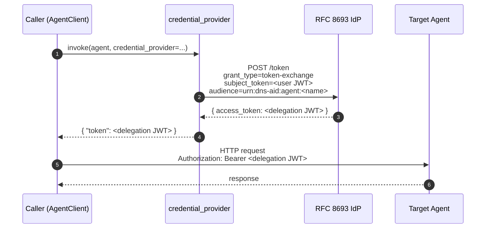

# Credentials handling in `dns-aid-core` SDK

This document describes how the `dns-aid-core` SDK handles caller-supplied
credentials when invoking AI agents. It is written for security reviewers
evaluating the SDK for adoption in regulated environments
(SOC 2, FedRAMP, HIPAA, financial services). Every claim is backed by code
references and automated regression tests.

The SDK applies credentials supplied by the application; it does not
source credentials itself. The application is responsible for the
security of its own credential store (Keycloak, Okta, Auth0, AWS STS,
HashiCorp Vault, KMS, HSM, etc.). The SDK's contract is: receive
credentials → apply them to outbound HTTP requests → never log, cache, or
persist them.

This document is part of the [feature 003 specification](../specs/003-credential-provider-callback/spec.md).
The architectural framing lives in [`docs/architecture.md`](architecture.md)
under "Caller-side credential application." The detailed contracts for the
public API surface live in:

- [`credential_provider_contract.md`](../specs/003-credential-provider-callback/contracts/credential_provider_contract.md)
- [`sigv4_explicit_credentials_contract.md`](../specs/003-credential-provider-callback/contracts/sigv4_explicit_credentials_contract.md)
- [`credential_provider_error_contract.md`](../specs/003-credential-provider-callback/contracts/credential_provider_error_contract.md)

For reporting security vulnerabilities, see [`SECURITY.md`](../SECURITY.md).

---

## How the SDK receives credentials

`AgentClient.invoke()` accepts credentials through three mutually-exclusive
paths, evaluated in precedence order:

| Order | Source | API |
|---|---|---|
| 1 | Pre-constructed `AuthHandler` override (highest priority) | `auth_handler=<handler instance>` |
| 2 | Pre-fetched credentials dict | `credentials={"token": "...", ...}` |
| 3 | Lazy callback invoked at call time | `credential_provider=<async callable>` |
| 4 | No-auth fallback (when target's `auth_type` permits it) | (no parameter) |

The first non-empty source wins; subsequent sources are not consulted.
When `credentials` and `credential_provider` are both supplied, the SDK
emits a `sdk.credential_provider_bypassed` debug log naming both sources so
developers can detect misconfiguration during testing.

The `credential_provider` callback is the recommended path for short-lived
delegation tokens (RFC 8693 token exchange) and dynamic secret stores
(Vault, AWS STS assume-role, HSM-backed signing keys). It receives the
target `AgentRecord` so it can derive per-target credentials.

### RFC 8693 token-exchange flow

The canonical pattern: the caller already holds the end user's access token
(obtained earlier via authorization code + PKCE during user sign-in). The
`credential_provider` callback exchanges that token for an actor-scoped
delegation token at invoke time, then returns the delegation token to the
SDK for the outbound call.



The delegation JWT returned by the IdP carries the full actor / subject
claim chain RFC 8693 prescribes — visible verbatim in the decoded payload:

```jsonc
{
  "iss":   "https://idp.example.com/realms/prod",
  "sub":   "alice",                    // end-user (the human)
  "act":   { "sub": "agent-x" },       // agent acting on alice's behalf
  "azp":   "client-id-of-actor-app",   // OAuth client that requested the exchange
  "aud":   "urn:dns-aid:agent:network-specialist",
  "scope": "tools:read tools:call",
  "exp":   1735689600,
  "iat":   1735686000
}
```

Downstream services authorise on `aud` + `scope`, log on `sub` (the user)
and `act.sub` (the agent), and chain the `azp` (the actor's OAuth client)
through to compliance / audit tooling. Some IdPs (Keycloak) emit the
actor identity as `azp` rather than the RFC-canonical `act`; the SDK is
agnostic — both are passed through unmodified by the bearer handler.

### Known limitations — proof-of-possession bindings

The current `credential_provider` contract returns credentials that map
to the standard `bearer` / `api_key` / `sigv4` / `oauth2` / `http_msg_sig`
handler shapes. **Proof-of-possession token bindings that require the
caller to attach additional headers to every outbound request — RFC 9449
DPoP, mTLS certificate-bound tokens, FAPI Pushed Authorisation Requests —
are not yet supported through the callback's return shape.**

Callers who need these today should use the `auth_handler` override
parameter with a custom `AuthHandler` subclass that implements the
binding's `apply(request)` method. A first-class `credential_provider`
return-shape extension for DPoP / mTLS proof-of-possession is tracked
for Phase 6.x.

---

## Per-handler security matrix (centrepiece)

The SDK ships six authentication handlers, each with the same security
guarantees. The matrix below shows each guarantee per handler. Cells that
say "uniform" mean the handler behaves identically to the others on that
row; any deviation is explicitly named.

| Guarantee | `none` | `api_key` | `bearer` | `oauth2` | `http_msg_sig` | `sigv4` |
|---|---|---|---|---|---|---|
| **1. No credential values in logs** | uniform — N/A | uniform | uniform | uniform | uniform | uniform (botocore.auth DEBUG suppressed during signing — see Bounded Exception 1) |
| **2. No SDK-side caching of credentials across invokes** | uniform — N/A | uniform | uniform | **see Bounded Exception 2** | uniform | uniform (signer holds frozen credentials for handler lifetime; not cached across invokes) |
| **3. Exception messages contain no credential values** | uniform — N/A | uniform | uniform | uniform | uniform | uniform |
| **4. Concurrency: no SDK-side synchronisation around provider; provider responsible for own safety** | uniform | uniform | uniform | uniform (handler has internal `asyncio.Lock` around its own token cache — see Bounded Exception 2) | uniform | uniform (reference-counted suppression context manager is thread-safe) |
| **5. Opt-in compatibility: existing `credentials={...}` path unchanged** | uniform | uniform | uniform | uniform | uniform | uniform — `credentials={"profile_name": "..."}` continues routing to boto3 default chain (see Bounded Exception 3) |
| **6. Audit trail support (RFC 8693 `sub`+`act` claims when used with delegation tokens)** | N/A | N/A | ✅ delegation tokens carry user identity in `sub` | N/A (client_credentials flow does not represent a user) | N/A (request-signing, not token-bearing) | ✅ STS assumed-role identity in `aws:userid` / CloudTrail |
| **7. Air-gapped operation: provider can be entirely local** | uniform | uniform | uniform | uniform | uniform (HSM-backed key path supported) | uniform (boto3 chain reads from local files / IAM instance metadata) |
| **8. FIPS / FedRAMP alignment** | uniform | uniform | uniform | uniform | ✅ FIPS 204 ML-DSA-65 PQC supported alongside Ed25519 | uniform — pattern matches AWS SDK (FedRAMP-authorized) |

Verified by automated regression tests:

- **Row 1** (`no credential values in logs`): `tests/unit/sdk/test_credential_provider_security.py` runs sentinel-based assertions across all six handlers. Each handler is invoked via `credential_provider` with a uniquely-marked sentinel credential value; the test fails the build if any sentinel appears in `caplog.text`, `caplog.records`, or any structured log field.
- **Row 3** (`exception sanitization`): `tests/unit/sdk/test_credential_provider_errors.py` (16 tests) verifies `CredentialProviderError.__str__` / `__repr__` / `args` / serialised forms contain no credential values from `__cause__`. `tests/unit/sdk/test_sigv4_explicit_credentials.py` extends this to validation errors from the SigV4 handler.
- **Row 4** (`concurrency`): `tests/unit/sdk/test_credential_provider_concurrency.py` verifies concurrent provider invocations are independent (no shared state contamination). `tests/unit/sdk/test_sigv4_explicit_credentials.py` includes a multi-thread test for the botocore.auth log suppression's reference counting.

---

## Bounded Exceptions

Two handlers deviate from the "no SDK-side caching" guarantee in row 2.
Both deviations are intentional, scoped, lock-protected, and called out
prominently so they cannot become integration-time surprises during
security review.

### Bounded Exception 1: SigV4 botocore.auth log suppression

**What**: When a `SigV4AuthHandler` signs a request, the SDK temporarily
disables the `botocore.auth` Python logger for the duration of the
signature computation.

**Why**: botocore.auth logs the canonical request at `DEBUG` level inside
`SigV4Auth.add_auth()`. The canonical request includes ALL signed headers
— among them `x-amz-security-token` (the STS session token). Any
application running with `botocore` at `DEBUG` level would otherwise leak
session tokens into its log stream every time SigV4 signs a request. This
is a known botocore behavior; we cannot fix it at the botocore layer.

**Scope**:

- The suppression is active only inside `SigV4Auth.add_auth()` — a single
  function call per signing. Before and after, the logger's `disabled`
  attribute is restored to whatever the application set it to.
- Reference-counted: if N concurrent SigV4 signings overlap, the logger is
  re-enabled only when the LAST signing exits. This prevents a race where
  one signing's "restore" runs while another is mid-call.
- Thread-safe via `threading.Lock`.

**Code**: `src/dns_aid/sdk/auth/sigv4.py` — function
`_suppress_botocore_auth_logs()`.

**Tests**:

- `tests/unit/sdk/test_credential_provider_security.py::test_provider_credentials_never_leak_in_logs[sigv4]` — sentinel session token does not appear in captured logs.
- `tests/unit/sdk/test_sigv4_explicit_credentials.py::TestBotocoreAuthLogSuppressionConcurrency` — nested + concurrent suppression contexts restore the correct original state.

**What it does NOT affect**:

- Other loggers (your application logs, `dns_aid.*` logs, etc.) are
  untouched.
- The `botocore.auth` logger is restored to its original state immediately
  after each signing — the suppression is not permanent.
- Non-SigV4 signing operations (e.g., your application calling boto3
  directly) are not affected because the suppression context only enters
  during our handler's own signing call.

### Bounded Exception 2: `OAuth2AuthHandler` per-instance access-token cache

**What**: The `OAuth2AuthHandler` caches the access token it acquires from
the configured OAuth 2.0 token endpoint, scoped to a single handler
instance.

**Why**: The OAuth 2.0 client-credentials grant exchanges a client ID +
secret for an access token. If the SDK refetched a token from the IdP on
every outbound request, a moderately busy application would hammer the
token endpoint (and potentially be rate-limited). Caching one token per
handler instance until ~30 seconds before expiry is the OAuth 2.0
industry-standard pattern.

**Scope**:

- The cache is **per-handler-instance**, not global. Two distinct
  `OAuth2AuthHandler` instances do not share tokens.
- The cache is **keyed by the handler's `client_id`** — different clients
  on the same handler instance produce different cache entries (in
  practice each handler instance has one client).
- The cache **respects token expiry with a 30-second buffer** — tokens
  near expiry are refreshed proactively rather than failing in flight.
- An internal `asyncio.Lock` serialises concurrent refresh attempts so a
  burst of requests against an expired token does not stampede the
  IdP's token endpoint.
- Tokens are held in memory only — never written to disk, never logged,
  never sent to any endpoint other than the target agent.

**Code**: `src/dns_aid/sdk/auth/oauth2.py` — `OAuth2AuthHandler` class.

**Tests**: existing tests in `tests/unit/sdk/auth/` cover the cache
behavior + serialisation invariants from before feature 003.

**Audit-friendly description for compliance reviewers**: this handler
performs in-memory caching of OAuth 2.0 access tokens with TTL respecting
the IdP-declared expiry. Tokens are not persisted, not transmitted other
than to the configured `auth_config.token_endpoint` (token refresh) and
the target agent (authorization header). Cache lifetime is bounded by
the handler instance lifetime; tokens are evicted when the handler is
garbage collected.

### Bounded Exception 3: `SigV4AuthHandler` boto3 default credential chain fallback

**What**: When no explicit credentials (`access_key`/`secret_key`/
`session_token`) are supplied at construction, `SigV4AuthHandler` falls
back to the standard boto3 default credential chain (environment
variables → `~/.aws/credentials` → IAM role / EC2 instance metadata).

**Why**: Backward compatibility with the existing pre-feature-003 SDK API
and with established AWS deployment patterns. Customers running on
EC2/ECS/Lambda routinely rely on the IAM-role path and would have to
manually fetch credentials otherwise.

**Scope**:

- Active only when `access_key` is `None` at handler construction.
- The boto3 chain is the only credential source consulted in this path —
  no application-provided credentials are read.
- boto3's own credential caching, refresh, and rotation behavior applies
  (managed entirely by boto3; the SDK simply calls
  `session.get_credentials().get_frozen_credentials()` on each `apply()`
  call to pick up rotated credentials).

**Code**: `src/dns_aid/sdk/auth/sigv4.py` — `_create_signer()` function.

**Tests**: `tests/unit/sdk/test_sigv4_backward_compat.py` (6 tests)
verifies every pre-existing constructor call pattern continues to work
unchanged after the explicit-credentials extension landed.

**Audit-friendly description for compliance reviewers**: when explicit
credentials are not supplied, this handler reads AWS credentials through
the boto3 default chain in the same way any boto3-using application would.
The application's existing AWS credential hygiene practices apply
unchanged.

---

## What the SDK does NOT control

The SDK is the credential **application** layer. The credential **sourcing**
layer is application-owned. This separation is deliberate so the SDK can
remain agnostic to which secret store the application uses.

| Concern | Application's responsibility | SDK's responsibility |
|---|---|---|
| Where credentials come from (Keycloak, Vault, AWS STS, KMS, env vars, …) | ✅ Application chooses | ❌ SDK does not source |
| How credentials are protected at rest | ✅ Application's secret store / HSM / KMS | ❌ SDK never persists credentials |
| Refresh / rotation cadence | ✅ Application's logic inside the `credential_provider` callback | ✅ SDK awaits provider freshly per invoke (no SDK-side caching beyond Bounded Exception 2) |
| Securing the credentials in memory during application use | ✅ Application | ✅ SDK does not log, cache, or transmit them other than to apply to outbound requests |
| Downstream consumer honoring `act` claim for audit | ✅ Downstream (MCP server, gateway, application middleware) | ❌ Out of SDK scope |
| Cryptographic algorithm strength (Ed25519, ML-DSA-65, ECDSA P-256, RSA) | ✅ Application chooses key type and parameters | ✅ SDK supports all standard algorithms via the relevant handlers |

---

## Concurrency model

The SDK adds **no synchronization** around the credential resolution path.
Concurrent `AgentClient.invoke()` calls await `credential_provider`
concurrently. The provider is responsible for its own concurrency safety.

The recommended pattern for providers that need to serialise external
calls (e.g., to a token endpoint) is the one used internally by
`OAuth2AuthHandler`: a per-instance `asyncio.Lock` around the network
call. This prevents request bursts from stampeding the upstream while
remaining lock-free for the typical case.

The only thread-shared state in the SDK's credential path is the
reference-counted suppression of `botocore.auth` logs (see Bounded
Exception 1). It is guarded by a `threading.Lock` and verified by
multi-thread test coverage.

---

## Error sanitisation

When the `credential_provider` callback raises, the SDK wraps the
exception in `CredentialProviderError`. The wrapper:

- Carries only `agent_fqdn` as public attribute.
- Preserves the original exception via Python's `__cause__` chain for
  deliberate inspection during debugging.
- Has a sanitised `__str__` / `__repr__` / `args` — no credential values
  from the provider's return dict appear in the wrapper's serialised form.
- Survives standard exception marshalling (e.g., for multiprocessing) with
  the same sanitisation invariants intact.

When the credential dict returned by the provider lacks required keys for
the declared `auth_type`, the registry factory raises `ValueError` with
the `auth_type` and missing key name in the message. The provider's
actual return value is **not** included in the error message.

Verified by `tests/unit/sdk/test_credential_provider_errors.py` (16 tests)
and the per-handler `test_credential_provider_security.py` (12 tests).

---

## Provider timeout (defence against hung callbacks)

The SDK bounds the `credential_provider` await with a configurable
timeout. A hanging provider (network stall, blocked socket, slow IdP)
cannot block `invoke()` indefinitely.

- Default: 30 seconds.
- Configure via `SDKConfig.credential_provider_timeout` or the env var
  `DNS_AID_CREDENTIAL_PROVIDER_TIMEOUT`.
- Timeout surfaces as a `CredentialProviderError` with the original
  `TimeoutError` preserved as `__cause__`. The `TimeoutError` itself
  carries no credential material.

This is separate from `SDKConfig.timeout_seconds` (the HTTP transport
timeout) — credential resolution and the HTTP call are independent
operations.

---

## FIPS / FedRAMP / SOC 2 alignment

The SDK introduces no new attack surface beyond the credential resolution
path described above. Specifically:

- No new network endpoints are contacted by the SDK during credential
  resolution. The provider may contact whatever it likes (IdP, STS,
  Vault); that's application code.
- No new persistent storage is introduced. Credentials live in memory for
  the duration of the handler instance, then become garbage-collectible.
- No new cryptographic primitives are introduced. The SDK uses
  `cryptography` (Ed25519, ECDSA P-256) and optionally `pqcrypto`
  (ML-DSA-65, FIPS 204) — both are FIPS-validated when configured against
  a FIPS-compliant OpenSSL build.

The pattern matches the AWS SDK (FedRAMP-authorized) for credential
delegation flows. SOC 2 Type II controls around credential handling are
satisfied by the SDK never persisting, logging, or transmitting credentials
outside the documented paths above.

---

## Air-gapped operation

The SDK has no network dependencies for credential resolution beyond
what the application's `credential_provider` callback itself contacts.
The callback can be entirely local:

- File-backed: read a JSON / TOML secret bundle from a permission-restricted
  path.
- HSM / KMS-backed: delegate signing operations to a hardware module via
  PKCS#11 or vendor SDKs.
- In-process: serve credentials from an in-memory secret manager that
  was hydrated from a sidecar process at startup.

The SDK does not introduce a "phone home" path or any telemetry that
includes credential material. The structured logs the SDK emits during
credential resolution contain only `auth_type`, `agent_fqdn`, and
resolution-outcome metadata.

---

## Verifying compliance for your environment

Three concrete steps a security reviewer can take to verify the
guarantees above against your specific deployment:

1. **Read the credential resolution code path end-to-end.** The complete
   surface is in two files:
   - `src/dns_aid/sdk/client.py` (`AgentClient.invoke()` +
     `_resolve_auth()`) — ~80 lines
   - `src/dns_aid/sdk/auth/registry.py` (factory dispatch) — ~50 lines
   Plus the six individual handler classes in `src/dns_aid/sdk/auth/`.
   Total auditable surface: under 600 lines.

2. **Run the audit script** at `scripts/audit_credential_handling.py`
   (when present). It scans the SDK for `structlog` calls that mention
   credential-shaped attribute names and reports any findings. Zero
   findings in the current source.

3. **Run the security regression suite**:
   ```bash
   uv run pytest tests/unit/sdk/test_credential_provider_security.py \
                 tests/unit/sdk/test_credential_provider_errors.py \
                 tests/unit/sdk/test_credential_provider_hardening.py \
                 tests/unit/sdk/test_sigv4_explicit_credentials.py
   ```
   All tests must pass. Together they exercise sentinel-based leak
   detection across every handler, exception sanitisation invariants,
   timeout enforcement, return-shape validation, cancellation passthrough,
   concurrency, and validation-message safety.

---

## Reporting

Security concerns or vulnerabilities: see [`SECURITY.md`](../SECURITY.md).

The maintainers commit to:

- Responding to security reports within 5 business days of receipt.
- Coordinating disclosure with the reporter before public discussion.
- Documenting any deviation from the guarantees above in this file as
  bounded exceptions, with code references and test coverage.
